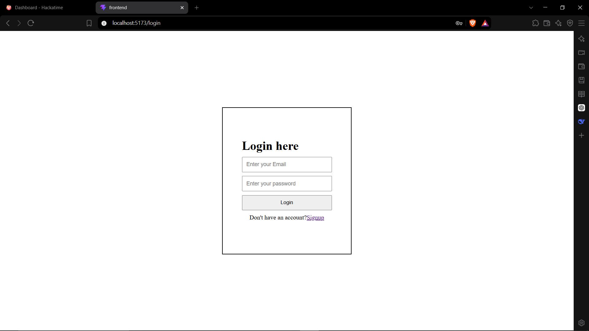
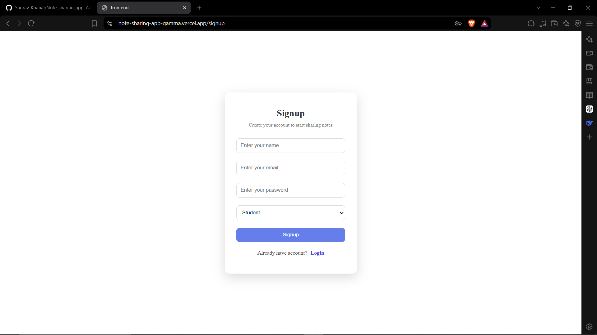
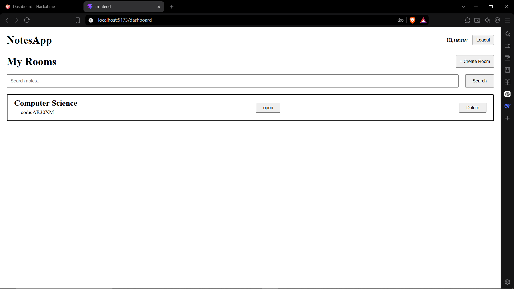
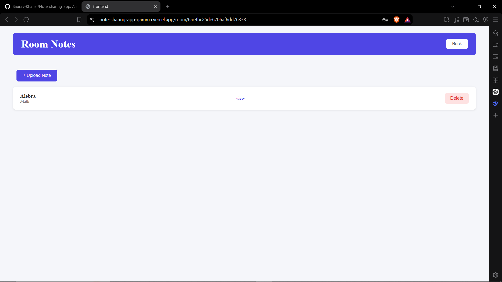
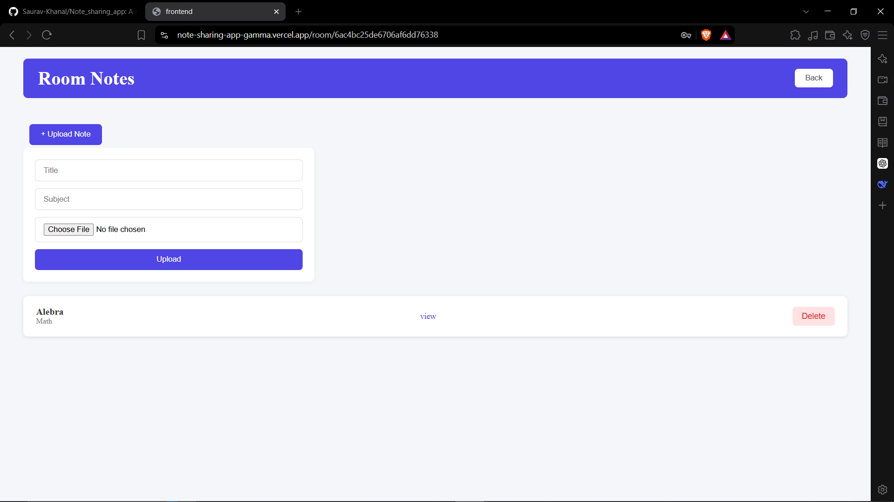

# Notesapp
notesapp is a simple website where the student and teacher can signup and share the note.teacher get the code once signup and the teacher can share that code with the student to invite them in the room to get access of note.i built this because in my classroom teacher send the notes in the messenger and after few days that notes get lost in the chat.and i feel the notes is not quite organized and difficult to see which note is what and  i feel time consuming.

## Live Demo

https://note-sharing-app-gamma.vercel.app


## Motivation
i personally feel the problem while finding the note in messenger app.so i thought why not to make the notes app where we can organized our note and find also when needed and also sharp by backend knowledge.

## Tech Stack

**Backend**
- Runtime: node.js
- Framework: express.js
- Database: mongoDB and Mongoose
- Authentication: jwt and bcrypt
- File Upload: multer

**Frontend**
- Framework: React
- Build Tool: Vite
- HTTP Client: Axios
- Styling: External CSS

## Features

- **Authentication:** JWT-based auth with hashed passwords using bcrypt
- **Room System:** Teachers create room and share the code students join using the code
- **File Upload:** Teachers can upload notes as PDF or images using Multer
- **Role-Based Access:** Only teachers can uplod and delete notes and rooms
- **Search:** Students can easily search notes by title or subject
- **Access Control:** Only room members can view the notes

## Challanges I faced

while bulding this i face many problems.jwt autentication was confuseing for me at first.i did'nt understand how token works and where to store it.file upload with multer was also hard.i didn't know form-data thing. and lot of error happeing. but slowly i fix all and learn many things.and i faced some problem with backend controller syntax error especailly.

## How To Run

1. Clone the repository
```sh
git clone https://github.com/Saurav-Khanal/Note_sharing_app
cd Note_sharing_app
```

2. Install backend dependencies
```sh
cd backend
npm install
```

3. Setup environment variables
Create a `.env` file in `backend/` folder with:
```
PORT=5000
MONGO_URI=your_mongodb_uri
JWT_SECRET=your_secret_key
```

4. Start backend
```sh
npm run dev
```

5. Install frontend dependencies (in a new terminal)
```sh
cd frontend
npm install
```

6. Start frontend
```sh
npm run dev
```

## Screenshots

### Login


### Signup


### Dashboard


### Room with Notes


### Upload Note



## AI Disclosure
i used chatgpt and deepseek for understanding the backend logic related authentication and to debug some syntax error.

## Future Improvements

- Email verification for signup
- Password reset
